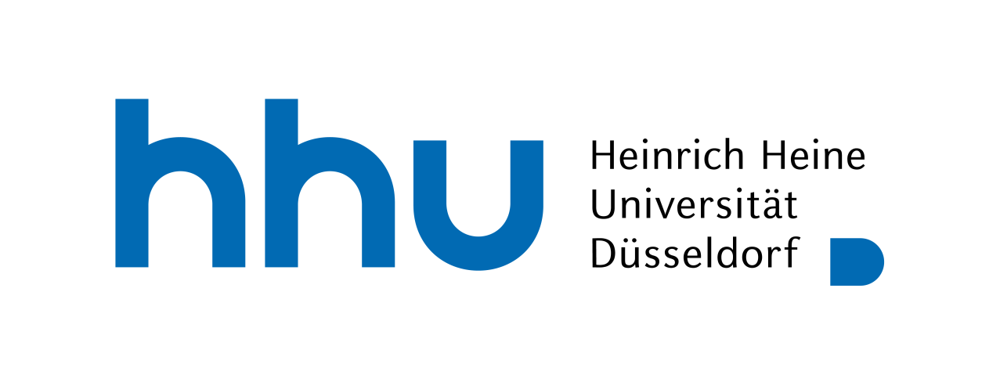

The 16th International Conference on Computational Semantics (IWCS) will be organized by <a href="https://www.hhu.de/" target="_blank" rel="noopener noreferrer">Heinrich Heine University (HHU)</a> and will take place at Düsseldorf, Germany from 22 to 24 September 2025.

IWCS is a biennial conference on computational semantics. The conference is endorsed by SIGSEM, the ACL Special Interest Group on Computational Semantics. The aim of IWCS is to bring together researchers interested in any aspects of the computation, annotation, extraction, representation, and learning of meaning in natural language, whether this is from a lexical or structural semantic perspective. IWCS embraces both symbolic and machine learning approaches to computational semantics, and everything in between. 

 

Important Dates:
------
* ~~**31 Januray 2025:** Workshop Proposal Submission Deadline~~
* **6 June 2025:** Paper Submission Deadline
* **1 August 2025:** Notification of Acceptance
* **22 August 2025:** Camera-Ready Due
* **22-23 September 2025:** Main Conference
* **24 September 2025:** Workshops

 

News and Updates:
------
* **13 December 2024:** First Call for Workshops 
* **10 January 2025:** Second Call for Workshops
* **7 February 2025:** [List of Accepted Workshops](workshops.md)
* **14 February 2025:** [First Call for Papers](call_for_papers.md)

<!--   -->

<!--  -->
