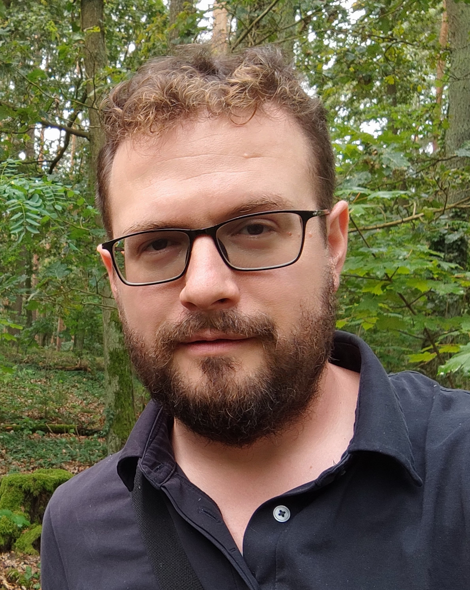

Keynotes
====

 

Oana-Maria Camburu (University College London)
----

Oana-Maria Camburu is a Principal Research Fellow in the Department of Computer Science at the University College London, holding an Early Career Leverhulme Fellowship. Prior to this, Oana was a postdoc in the Department of Computer Science at the University of Oxford, from where she also obtained her PhD in "Explaining Deep Neural Networks". Her main research interests lie in explainability for deep learning models, with applications in natural language processing and vision-language tasks, for which she received several fellowships and grants.

 

Alexander Koller (Saarland University)
----

Alexander Koller is a Professor of Computational Linguistics at
Saarland University in Saarbrücken, Germany. His research interests
include planning and reasoning with LLMs, syntactic and semantic
processing, natural language generation, and dialogue systems. He is
particularly interested in neurosymbolic models that bring together
principled linguistic modeling and correctness guarantees with the
coverage and robustness of neural approaches. Alexander received his
PhD from Saarland University and was previously a postdoc at Columbia
University and the University of Edinburgh, faculty at the University
of Potsdam, and Visiting Senior Research Scientist at the Allen
Institute for AI.

 

Denis Paperno (Utrecht University)
---

 

Denis Paperno is assistant professor of computational linguistics at Utrecht University. He received a PhD in Linguistics from the University of California Los Angeles, and subsequently worked at the University of Trento (CLIC lab, Rovereto) as a postdoc and at the Loria lab (Nancy) as a CNRS researcher. Denis has published extensively in the fields of semantics, language model evaluation, and vector space representations of meaning. His research contributions include work on compositionality in computational models of semantics, visual grounding, and representation probing.

